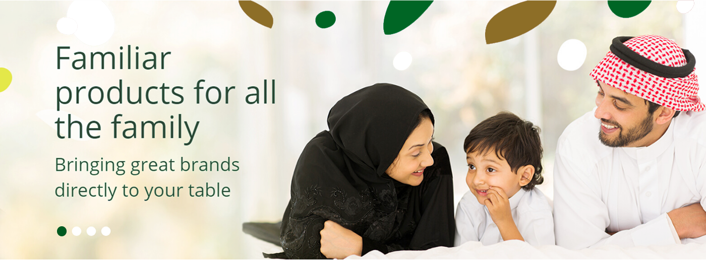
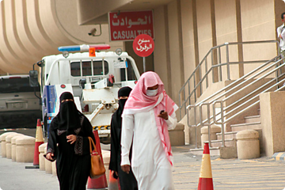

<!DOCTYPE html>
<html dir="ltr" lang="en">
   <head>
      <meta charset="utf-8" />
      <meta http-equiv="X-UA-Compatible" content="IE=edge" />
      <meta name="viewport" content="width=device-width, initial-scale=1" />
      <title>index</title>
      <!-- Bootstrap -->
      <link href="css/bootstrap.min.css" rel="stylesheet">
      <!-- fontawesome -->
      <link href="css/fontawesome.min.css" rel="stylesheet" />
      <!-- linearicons -->
      <link rel="stylesheet" href="https://cdn.linearicons.com/free/1.0.0/icon-font.min.css" />
      <!-- owl carousel -->
      <link rel="stylesheet" href="css/owl.theme.default.min.css" />
      <link rel="stylesheet" href="css/owl.carousel.css" />
      <!-- wow.js style -->
      <link rel="stylesheet" href="css/animate.css" />
      <!-- stylesheet -->
      <link href="css/style.css" rel="stylesheet" />
      <!-- <link href="font/stylesheet.css" rel="stylesheet">-->
      <!-- HTML5 Shim and Respond.js IE8 support of HTML5 elements and media queries -->
      <!-- WARNING: Respond.js doesn't work if you view the page via file:// -->
      <!--[if lt IE 9]>
      
      
      <![endif]-->
   </head>
   <body>
      

      <!-- start header section -->
      <header>
         

            

               

                  

                     

                        
                        
 Riyadh Capital of Saudi Arabia

                     

                     

                        
                        
 info@sitename.com

                     

                  

                  

                     <ul class="social-icons">
                        <li>
                           <a href="#">
                           <i class="fab fa-facebook-f social-icon"></i>
                           </a>
                        </li>
                        <li>
                           <a href="#">
                           <i class="fab fa-twitter social-icon"></i>
                           </a>
                        </li>
                        <li>
                           <a href="#">
                           <i class="fab fa-instagram social-icon"></i>
                           </a>
                        </li>
                        <li>
                           <a href="#">
                           <i class="fab fa-snapchat-ghost social-icon"></i>
                           </a>
                        </li>
                     </ul>
                  

               

            

         

         

            

               

                  

                     
                  

                  

                     <input class="search-input" type="text" name="text" placeholder="search ...">
                     <button class="search-btn"></button>
                  

                  

                     
                  

               

            

         

         

            

               <nav class="nav-nav">
                  <ul class="nav-list  navv">
                     <li class="hidden-lg hidden-md">
                        
                     </li>
                     <li>
                        <a href="#" class="menu-link">home</a>
                     </li>
                     <li>
                        <a href="#" class="menu-link">about us</a>
                     </li>
                     <li>
                        <a href="#" class="menu-link">departments</a>
                     </li>
                     <li>
                        <a href="#" class="menu-link">testimonials </a>
                     </li>
                     <li>
                        <a href="#" class="menu-link">news </a>
                     </li>
                     <li>
                        <a href="#!" class="menu-link">contact us </a>
                     </li>
                  </ul>
               </nav>
               <button class="booking-btn">book an appointment</button>
            

         

         

            <a class="nav-toggle" href="#!">
            
            </a>
            

               
               <ul class="menu-list">
                  <li><a href="#" class="mobile-menu-link">home</a></li>
                  <li><a href="#" class="mobile-menu-link">about us</a></li>
                  <li><a href="#" class="mobile-menu-link">departments</a></li>
                  <li><a href="#" class="mobile-menu-link">testimonials</a></li>
                  <li><a href="#" class="mobile-menu-link">news</a></li>
                  <li><a href="#" class="mobile-menu-link">contact us</a></li>
               </ul>
               

                  <ul class="social-icons">
                     <li>
                        <a href="#">
                        <i class="fab fa-facebook-f social-icon"></i>
                        </a>
                     </li>
                     <li>
                        <a href="#">
                        <i class="fab fa-twitter social-icon"></i>
                        </a>
                     </li>
                     <li>
                        <a href="#">
                        <i class="fab fa-instagram social-icon"></i>
                        </a>
                     </li>
                     <li>
                        <a href="#">
                        <i class="fab fa-snapchat-ghost social-icon"></i>
                        </a>
                     </li>
                  </ul>
               

            

         

      </header>
      <!-- end header section -->
      <!-- start slider carousel -->
      

         

            
         

         

            
         

         

            
         

         

            
         

      

      <!-- end slider carousel -->
      <!-- start tabs section -->
      

         <section class ="wrapper">
            

               <!-- Tab links -->
               

                  <button class="tablinks active" data-country="about-us">
                  
                  
                  
                  about us
                  Over thirty years
                  </button>
                  <button class="tablinks" data-country="vision">
                  
                  
                  
                  our vision
                  A young, energetic team
                  </button>
                  <button class="tablinks" data-country="mission">
                  
                  
                  
                  our mission
                  Working to get results
                  </button>
               

               <!-- Tab content -->
               

                  

                     
Reproduction clinic was created with a completely clear and simple purpose – to make people
                        happy. Its team does it by using modern methods of assisted reproductive technology and prenatal diagnostics.
                        Our specialists are the founders of the modern reproductive medicine in the world and working in the
                        field of Assisted Reproductive Technologies for more than 10 years. 
                     

                  

                  

                     
Reproduction clinic was created with a completely clear and simple purpose – to make people
                        happy. Its team does it by using modern methods of assisted reproductive technology and prenatal diagnostics.
                        Our specialists are the founders of the modern reproductive medicine in the world and working in the
                        field of Assisted Reproductive Technologies for more than 10 years. 
                     

                  

                  

                     
Reproduction clinic was created with a completely clear and simple purpose – to make people
                        happy. Its team does it by using modern methods of assisted reproductive technology and prenatal diagnostics.
                        Our specialists are the founders of the modern reproductive medicine in the world and working in the
                        field of Assisted Reproductive Technologies for more than 10 years. 
                     

                  

               

            

         </section>
      

      <!-- end tabs section -->
      <!-- start news section  -->
      

         

            <h1 class="news-title wow pulse">last news</h1>
            

               

                  

                     

                        
                        

                        

                     

                     

                        <a href="#" class="new-name">cardiac clinic  </a>
                        
Cardiology is a branch of medicine dealing with disorders of the heart as well as parts of the circulatory system.

                     

                  

               

               

                  

                     

                        
                        

                        

                     

                     

                        <a href="#" class="new-name">cardiac clinic  </a>
                        
Cardiology is a branch of medicine dealing with disorders of the heart as well as parts of the circulatory system.

                     

                  

               

               

                  

                     

                        
                        

                        

                     

                     

                        <a href="#" class="new-name">cardiac clinic  </a>
                        
Cardiology is a branch of medicine dealing with disorders of the heart as well as parts of the circulatory system.

                     

                  

               

            

         

      

      <!-- end news section -->
      <!-- start newsletter section -->
      <section class="newsletter wow fadeInDown">
         

            

               

                  <h2 class="vote-title">Do you like this website?</h2>
                  <label class="form-control vote-control">
                  <input class="radio-btn" type="radio" name="radio" />
                  Yes
                  </label>
                  <label class="form-control vote-control">
                  <input class="radio-btn" type="radio" name="radio" />
                  It could be better
                  </label>
                  <label class="form-control vote-control">
                  <input class="radio-btn" type="radio" name="radio" />
                  No
                  </label>
                  

                     <button class="vote-btn">Vote</button>
                  

               

               

                  
When the health of your child is concerned, no parent
                     can simply stand by idly. We will supply you with the best
                     healthcare tips and child diseases prevention advice!
                  

                  <input class="newsletter-input-field" type="text" name="text" placeholder="enter your email">
                  

                     <button class="vote-btn">Subscribe</button>
                  

               

            

         

      </section>
      <!-- end newsletter section -->
      <!-- start map section  -->
      <section class="map-section">
         

            
<iframe class="map-iframe" id="gmap_canvas" src="https://maps.google.com/maps?q=ryadh&t=&z=13&ie=UTF8&iwloc=&output=embed" ></iframe><a href="https://123movies-to.org">123movies</a> <a href="https://www.embedgooglemap.net">email google map</a>

         

      </section>
      <!-- end map section -->
      <!-- start footer -->
      <footer>
         

            

               

                  

                     <button class="accordion footer-accordion">
                     categories 
                     <i class="fas fa-angle-down hidden-lg hidden-md left-right-arrow"></i>
                     <i class="fas fa-angle-up hidden-lg hidden-md down-arrow-2"></i>
                     </button>
                     <ul class="footer-list panel footer-dropdown">
                        <li><a href="#">home</a></li>
                        <li><a href="#">departments </a></li>
                        <li><a href="#">testimonials </a></li>
                        <li><a href="#">news </a></li>
                        <li><a href="#">contact us </a></li>
                     </ul>
                  

                  

                     <button class="accordion footer-accordion">
                      service
                     <i class="fas fa-angle-down hidden-lg hidden-md left-right-arrow"></i>
                     <i class="fas fa-angle-up hidden-lg hidden-md down-arrow-2"></i>
                     </button>
                     <ul class="footer-list panel footer-dropdown">
                        <li><a href="#">about us </a></li>
                        <li><a href="#">delivery & returns</a></li>
                        <li><a href="#">terms & conditions</a></li>
                        <li><a href="#">privacy policy</a></li>
                     </ul>
                  

                  

                     <button class="accordion footer-accordion">
                     opining hours
                     <i class="fas fa-angle-down hidden-lg hidden-md left-right-arrow"></i>
                     <i class="fas fa-angle-up hidden-lg hidden-md down-arrow-2"></i>
                     </button>
                     <ul class="footer-list panel footer-dropdown">
                        <li><a href="#">working days: mon - fri. </a></li>
                        <li><a href="#">Working Hours: 9.00AM - 5.00PM </a></li>
                     </ul>
                  

                  

                     
                  

               

            

         

         

            
Copyraights © 2017 All Rights Reserved - Designed & Develoded by: Tasawk 

         

      </footer>
      <!-- end footer -->
      <!-- start scroll to top button -->
      

         

            <button onclick="topFunction()" class="myBtn" title="Go to top"></button>
         

      

      <!-- end scroll to top button -->
      
      <!-- jQuery (necessary for Bootstrap's JavaScript plugins) -->
      
      <!-- owl carousel -->
      
      <!-- wow js -->
      
      <!-- my javascript code -->
      
   </body>
</html>
